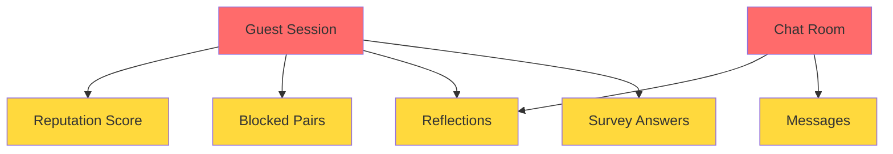

# Data Retention Policy

**Last Updated:** October 14, 2025  
**Version:** 1.0

## 1. Introduction & Scope

This Data Retention Policy explains how long Conversely retains your data, how we delete it, and the automated systems that ensure your privacy is protected.

**This policy applies to:**
- All users of conversely.online
- All data types collected during your use of the Service
- Automated and manual deletion processes

**Relationship to Privacy Policy:**  
This policy supplements our [Privacy Policy](/privacy), which describes what data we collect and how we use it. This document focuses specifically on retention timelines and deletion mechanisms.

## 2. Data Lifecycle Overview

Every piece of data on Conversely follows a predictable lifecycle:

1. **Creation** → Data is generated when you use the platform
2. **Storage** → Data is temporarily stored in our database
3. **Expiry** → Data reaches its retention deadline
4. **Deletion** → Data is permanently removed with no recovery

**Key Principles:**
- Automated deletion runs continuously—no human intervention required
- Once deleted, data is permanently gone and cannot be recovered
- No backups of user content (messages, conversations) are retained
- Shorter retention = better privacy

## 3. Retention Periods by Data Type

| Data Type | Retention Period | Deletion Method | Legal Basis |
|-----------|------------------|-----------------|-------------|
| **Messages** | 2 minutes | Automated (cron every 5 min) | Privacy by design (GDPR Art. 5) |
| **Guest Sessions** | 24 hours | Automated (cron hourly) | Session lifecycle management |
| **Survey Answers** | 24 hours | Cascade (deleted with session) | Tied to temporary session |
| **Chat Rooms** | 2 min after chat ends | Automated (cron every 5 min) | Privacy by design |
| **Reflections** | 24 hours | Cascade (deleted with session/room) | Post-chat feedback collection |
| **Blocked Pairs** | 24 hours | Cascade (deleted with session) | Abuse prevention |
| **Reputation Scores** | 24 hours | Part of session data | Ephemeral anti-abuse tracking |
| **Security Logs** | 60 days | Scheduled cleanup | Fraud investigation (GDPR Art. 6) |
| **Error Logs** | 30 days | Scheduled cleanup | Platform stability & debugging |
| **Moderation Flags** | 60 days | Scheduled cleanup | Policy enforcement & appeals |
| **Maintenance Logs** | 90 days | Automated cleanup function | System health monitoring |
| **Platform Logs** | ~90 days | Provider-managed (Lovable Cloud) | Operational monitoring |

### Detailed Retention Explanations

**Messages (2 minutes)**  
Every message you send expires 2 minutes after being sent. This is enforced at the database level with automatic expiry timestamps. Messages are deleted by a scheduled cleanup job that runs every 5 minutes.

**Guest Sessions (24 hours)**  
Your temporary session lasts 24 hours from creation. When it expires, all associated data (survey answers, reflections, blocked pairs, reputation scores) is automatically deleted via cascade rules.

**Chat Rooms (2 minutes after end)**  
When a conversation ends (either party clicks "End Chat" or both users disconnect for 2 minutes), the room is marked as closed. The room and its metadata are deleted 2 minutes later by automated cleanup.

**Reputation Scores (24 hours)**  
Behavioral tracking scores (used for matching quality and abuse prevention) are ephemeral and reset when your session expires. These are not linked to any permanent identity.

**Security & Moderation Logs (30-60 days)**  
Technical logs used for fraud detection, abuse investigation, and policy enforcement are retained for 30-60 days to allow for manual review and appeals. These contain no message content—only metadata like timestamps, session IDs, and flagged event types.

**Maintenance Logs (90 days)**  
System health telemetry (e.g., cleanup job statistics, performance metrics) is retained for 90 days. These logs contain no user-identifiable information or personal data.

**Platform-Level Logs (~90 days)**  
Platform-level service logs (e.g., Lovable Cloud, Supabase infrastructure logs) are retained per provider policy, typically not exceeding 90 days, and are used solely for operational monitoring and security incident response.

## 4. Automated Deletion Mechanisms

Conversely uses multiple automated systems to enforce retention limits:

### Scheduled Cleanup Jobs (Cron)

**Message Cleanup**  
- Runs every 5 minutes
- Deletes all messages where `expires_at < now()`
- Timing: Typically deletes messages within 2-7 minutes after expiry

**Session Cleanup**  
- Runs every hour
- Deletes all sessions where `expires_at < now()`
- Triggers cascade deletion of survey answers, reflections, blocked pairs

**Inactive Room Cleanup**  
- Runs every 5 minutes
- Closes rooms with no activity for 5 minutes
- Closes rooms where both users' heartbeats are stale (2 minutes)
- Marks rooms as `ended` for final deletion

### Database Cascade Rules

When a session is deleted, the following data is automatically removed:
- Survey answers
- Reflections
- Blocked pairs
- Reputation scores (part of session record)

When a chat room is deleted:
- Associated messages (if not already expired)
- Room metadata

### Expiry Timestamps

All ephemeral data has a database-level `expires_at` timestamp:
- Messages: Set to `now() + 2 minutes` at creation
- Sessions: Set to `now() + 24 hours` at creation

These timestamps cannot be extended—when the deadline passes, deletion is automatic.

## 5. Data Dependencies & Cascade Deletion

**Deletion Hierarchy:**  
When a **Guest Session** expires (24 hours) → **Survey Answers**, **Reflections**, **Blocked Pairs**, and **Reputation Scores** are automatically deleted.

When a **Chat Room** closes → **Messages** (if not already expired) and **Room Metadata** are deleted.

**No Orphaned Data:**  
Cascade rules ensure that no data is left behind when a parent record (session or room) is deleted.

## 6. Manual Deletion Requests

### Self-Service Deletion (Recommended)

For immediate deletion of your data, use our real-time self-service portal at [/privacy-requests](/privacy-requests).

**While your session is active (within 24 hours):**
- Click **"Delete My Data"** to permanently remove:
  - Your session record
  - Survey answers
  - Reflections
  - Blocked pairs
  - Reputation scores
  - Any active chat room data
- Deletion happens instantly with JWT token revocation
- An audit trail is logged for compliance purposes

**After deletion:**
- Your session is immediately terminated
- You cannot undo this action
- Messages are already auto-deleted (2-minute expiry), so they're not included in manual deletion

### Email-Based Deletion (Fallback)

If you cannot access the self-service portal, you can request deletion by emailing **hello@conversely.online** with the subject "Data Deletion Request."

**What to include:**
- Your session timestamp or approximate usage date
- Any identifying information (username, conversation details) to help us locate your data

**Response timeline:**
- We will respond within 48 hours
- However, most data expires automatically within 24 hours anyway

**What can be deleted:**
- Active sessions and associated data (if still within 24-hour window)
- Survey answers, reflections, blocked pairs

**What cannot be deleted:**
- Expired data (already permanently removed)
- Platform logs needed for security investigations (retained 30-90 days per Section 3)

**Verification:**  
We may request verification to confirm you are the session owner and prevent unauthorized deletion requests.

## 7. Legal & Compliance Basis

Our data retention practices comply with:

**GDPR (EU General Data Protection Regulation)**
- **Article 5(1)(e):** Storage limitation—personal data shall be kept in a form which permits identification of data subjects for no longer than is necessary
- **Article 17:** Right to erasure ("right to be forgotten")—data subjects have the right to obtain the erasure of personal data without undue delay

**CCPA/CPRA (California Consumer Privacy Act)**
- Data minimization requirements—businesses must limit collection and retention to what is reasonably necessary
- Right to deletion—consumers have the right to request deletion of their personal information

**Privacy by Design:**  
Our 2-minute message expiry and 24-hour session lifecycle are intentional design choices that prioritize user privacy over data accumulation.

**Why Short Retention = Better Privacy:**
- Reduces exposure window for data breaches
- Minimizes data available for legal requests or subpoenas
- Prevents long-term profiling or tracking
- Aligns with principles of data minimization

## 8. Data Recovery & Backups

**No User Content Backups:**  
We do not create backups of user content (messages, conversations, survey answers). Once deleted, this data is permanently gone.

**System Backups:**  
We may maintain system-level backups for disaster recovery, but these:
- Exclude ephemeral user data (messages, sessions)
- Contain only infrastructure configuration and long-term system logs
- Are subject to the same retention limits as production data

**No Recovery Possible:**  
Once data expires and is deleted, it cannot be recovered—not even by our administrators. This is by design to ensure your privacy.

## 9. Changes to This Policy

We may update this Data Retention Policy from time to time.

**Notification Process:**
- Changes will be posted with a revised "Last Updated" date
- Material changes (e.g., extending retention periods) will require re-acceptance before continued use
- Non-material changes (clarifications, formatting) will take effect immediately

**What Constitutes a Material Change:**
- Extending retention periods for user content (messages, sessions)
- Changing automated deletion mechanisms to manual processes
- Adding new data types with longer retention
- Reducing deletion frequency

## 10. Contact Information

For questions about data retention or deletion:

- **Email:** hello@conversely.online
- **Subject:** "Data Retention Question" or "Data Deletion Request"
- **Response Time:** Within 48 hours for general questions, within 30 days for formal deletion requests

---

**Summary:**  
Most of your data on Conversely is deleted automatically within 24 hours. Messages disappear after 2 minutes, sessions expire after 24 hours, and technical logs are retained for 30-90 days for security and operational purposes. We do not create backups of user content, and once deleted, data is permanently gone. This aggressive retention policy is intentional—it protects your privacy by minimizing data exposure.

**Last Updated:** October 14, 2025 | **Version:** 1.0
